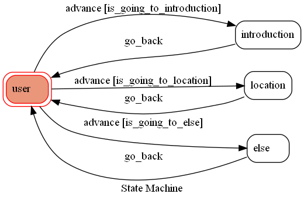

# TOC_final_project
### Introduction
這個是模擬成大餐廳的官方帳號

@關於:會有使用說明

@地址:會傳送餐廳所在地

傳送其他文字:會回「不好意思，我不清楚」

(有使用簡易的PostgreSQL，能去記錄使用者的基本資料)

### Prerequisite
* Python 3.10.9
* Virtualenv
* Line App
* HTTPS Server
* Pygraphviz

#### Secret Data
You should generate a `.env` file to set Environment Variables refer to our `.env.sample`.
`LINE_CHANNEL_SECRET` and `LINE_CHANNEL_ACCESS_TOKEN` **MUST** be set to proper values.
Otherwise, you might not be able to run your code.

#### Run Locally
You can either setup https server or using `ngrok` as a proxy.

#### a. Ngrok installation
* [ macOS, Windows, Linux](https://ngrok.com/download)

or you can use Homebrew (MAC)
```sh
brew cask install ngrok
```

**`ngrok` would be used in the following instruction**

```sh
ngrok http 5000
```

After that, `ngrok` would generate a https URL.

#### Run the sever

```sh
python3 app.py
```

#### b. Servo

Or You can use [servo](http://serveo.net/) to expose local servers to the internet.


## Finite State Machine



## Reference

[TOC-Project-2019](https://github.com/winonecheng/TOC-Project-2019) ❤️ [@winonecheng](https://github.com/winonecheng)

[TOC-Project-2020](https://hackmd.io/@TTW/ToC-2019-Project#/)

[Line line-bot-sdk-python](https://github.com/line/line-bot-sdk-python/tree/master/examples/flask-echo)

https://ithelp.ithome.com.tw/m/users/20144761/ironman/5735?fbclid=IwAR2SUyeN4jZaBa3e54Ne5U3QRnBEbX51q42YKbWtX9HkR2YFY5WvnJYMe8Y
